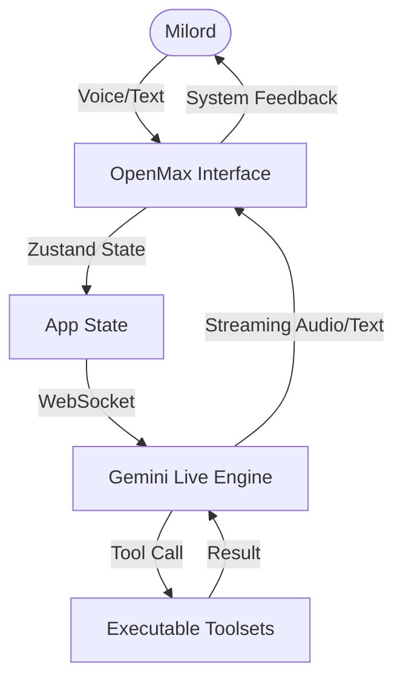

# Eburon OpenMax

<div align="center">
  
  <p><strong>Premier Executive AI Control Interface • Human-Machine Synergy</strong></p>
</div>

---

## 🌟 Overview

**Eburon OpenMax** is a high-performance, real-time AI interface designed for Milord. It bridges the gap between raw compute power and executive decision-making. Built on the Gemini Live API, it provides a seamless, low-latency environment for orchestration, system management, and multi-modal interaction.

This platform isn't just an assistant; it is **Operational Intelligence** tailored for elite performance.

## 🛠 Tech Stack

- **Frontend**: React 18 + TypeScript + Vite
- **State Management**: Zustand (Centralized high-performance state)
- **Real-time Engine**: Google Gemini Live API (@google/genai)
- **Styling**: Premium Vanilla CSS (Eburon Stark-Mode Aesthetic)
- **Backend API**: Node.js + Express (File processing & System bridges)
- **Communication**: WebRTC (Low-latency audio/video streaming)

## 🏗 Architecture & Workflow

OpenMax utilizes a bidirectional WebSocket architecture to synchronize the user's intent with the AI's execution governor.



### Core Components

1. **Orchestration Layer (`App.tsx`)**: Manages the main viewport, authentication guards, and mode switching.
2. **Control Center (`ControlTray.tsx`)**: The mission-control interface for microphone, mode toggles, and connectivity status.
3. **Intelligence Module (`contexts/LiveAPIContext.tsx`)**: Handles the complex handshake and real-time streaming with the Gemini Live backend.
4. **Executive Sidebar (`Sidebar.tsx`)**: Allows Milord to dynamically inject system prompts and manage active function call toolsets (Orbit vs. Beatrice).
5. **Interaction Engine (`ChatInput.tsx`)**: Processes multi-modal inputs, including text prompts and direct file injections.

## 🚀 Getting Started

### Prerequisites

- Node.js (v18+)
- A valid Gemini API Key from Eburon / AI Studio

### Setup

1. **Clone and Install**:

   ```bash
   npm install
   ```

2. **Configure Environment**:

   Create or edit `.env.local`:

   ```env
   REACT_APP_GEMINI_API_KEY=your_api_key_here
   ```

3. **Initialize Development Engine**:

   ```bash
   npm run dev
   ```

## 📱 Mobile Optimization

OpenMax is fully optimized for executive use in the field:

- **Responsive Stacking**: Interfaces adapt vertically for smaller viewports.
- **Drawer Controls**: Settings and logs utilize a high-performance drawer system.
- **Touch Targets**: Optimized for high-precision mobile interaction.

---

<div align="center">
  <p>© 2026 Eburon Development. All rights reserved. Professional Grade Intelligence.</p>
  <a href="https://eburon.ai">eburon.ai</a>
</div>
